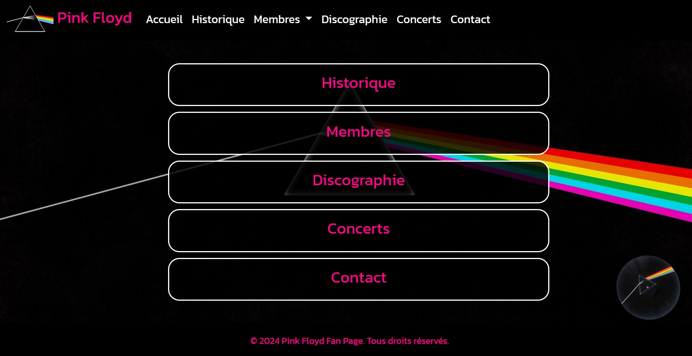

# 🎸 Site Web sur Pink Floyd

link: https://xorcist15.github.io/BENHASSINE_grp_musique/



## Description

Projet réalisé en première année de développement web.
Il s'agit d'un site vitrine simple dédié à mon groupe de musique préféré : **Pink Floyd**.

## Contenu du site

* Page d’accueil avec une brève présentation du groupe
* Galerie d’albums emblématiques
* Biographie des membres
* Design sobre et responsive

## Technologies utilisées

* HTML5
* CSS3
* Un peu de JavaScript (animations, interactions)

## Objectifs pédagogiques

* Apprendre les bases du HTML/CSS
* Structurer un site en plusieurs pages
* Utiliser des balises sémantiques
* Travailler un peu la mise en page et le responsive design

## Comment voir le site

Ouvre le fichier `index.html` dans ton navigateur, ou utilise un serveur local :

```bash
# exemple avec Python
python -m http.server
```

## Remarques

Projet simple, non connecté à une base de données.
Fait principalement pour apprendre à structurer un site statique.
